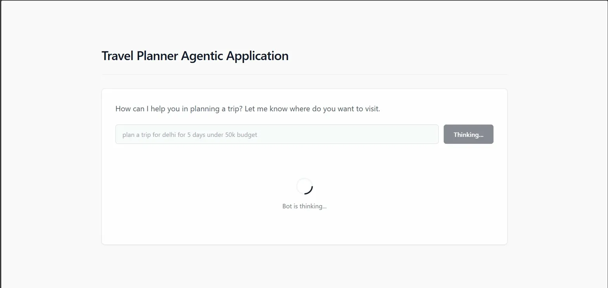
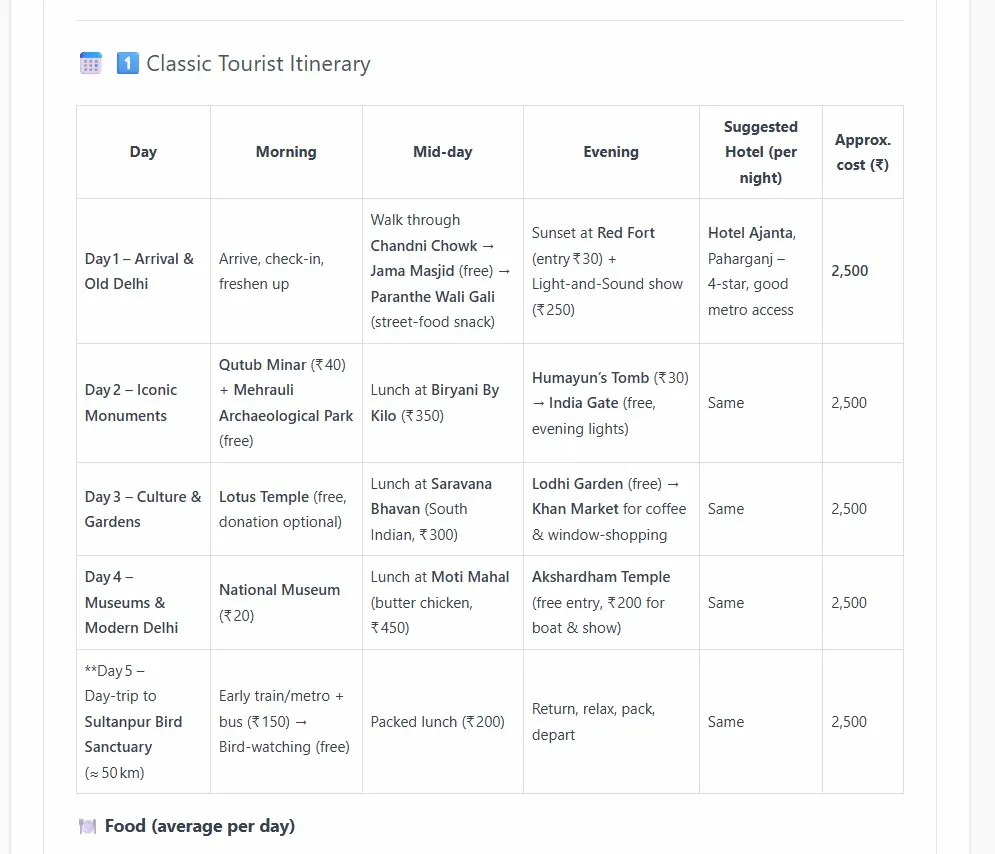
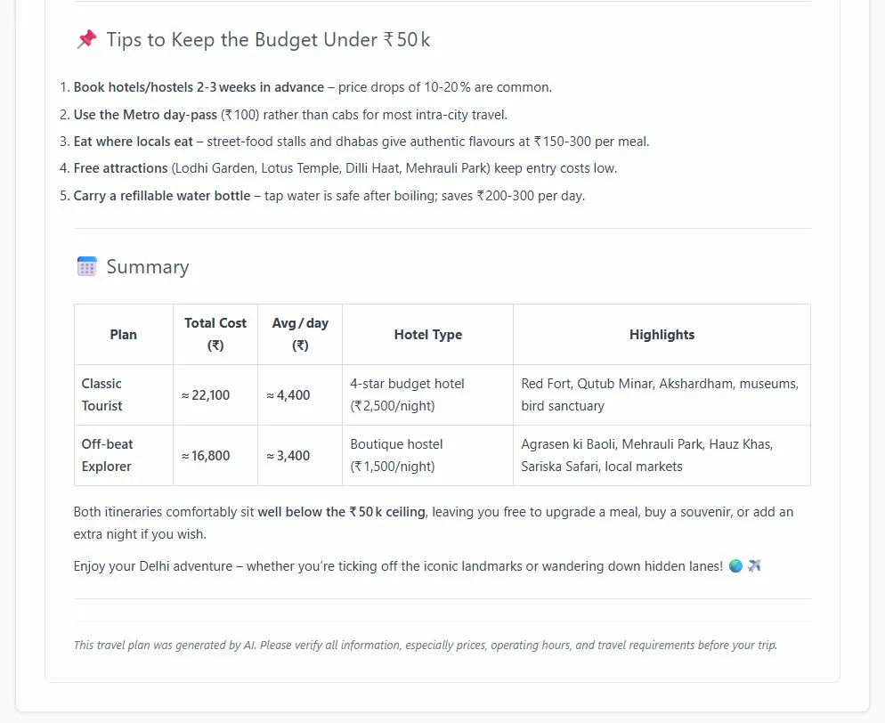

<div align="center">

# ✈️ Trip Planner Agent

<p>An <strong>agentic AI-powered travel planning application</strong> that generates full trip itineraries, budget breakdowns, and local tips — all in seconds. Just type where you want to go, and the agent handles the rest.</p>

<div>


</div>

| Layer | Repository |
|-------|-----------|
| 🖥️ Frontend | [Trip-Planner-Agent](https://github.com/AbhinavCoder-14/Trip-Planner-Agent) |
| 🧠 Backend | [Deep-Seeker-Agent](https://github.com/AbhinavCoder-14/Deep-Seeker-Agent) |

</div>

---

## 📋 Table of Contents

1. [Overview](#overview)
2. [Architecture](#architecture)
3. [How It Works — Data Flow](#how-it-works--data-flow)
4. [Agent Reasoning Loop](#agent-reasoning-loop)
5. [Output Breakdown](#output-breakdown)
6. [Project Structure](#project-structure)
7. [Tech Stack](#tech-stack)
8. [Getting Started](#getting-started)
   - [Prerequisites](#prerequisites)
   - [Backend Setup](#backend-setup)
   - [Frontend Setup](#frontend-setup)
9. [Environment Variables](#environment-variables)
10. [Screenshots](#screenshots)
11. [Contributing](#contributing)
12. [License](#license)

---

## Overview

Trip Planner Agent is a full-stack agentic application where a **Python-based LLM agent** (powered by LangGraph) orchestrates multiple tools — web search, budget calculation, itinerary structuring, and prompt engineering — to produce a detailed, budget-aware travel plan. The **React + TypeScript frontend** provides a clean chat-like interface that streams the agent's thinking process in real time.

> **Key idea:** You don't just get a static response. The backend *reasons step-by-step* through your request using an agentic graph, and the frontend visualizes that process live.

---

## Architecture

The system is split into two independent services that communicate over HTTP:

```
┌─────────────────────────────────────────────────────────────────┐
│                         USER BROWSER                            │
│                                                                 │
│   ┌──────────────────────────────────────────────────────────┐  │
│   │          Trip Planner Agent  (React + TS + Vite)         │  │
│   │                                                          │  │
│   │   ┌─────────┐   POST /plan   ┌────────────────────────┐ │  │
│   │   │  Input  │ ─────────────► │  Loading / Streaming   │ │  │
│   │   │  Field  │                │  "Bot is thinking..."  │ │  │
│   │   └─────────┘                └────────────┬───────────┘ │  │
│   │                                           │              │  │
│   │                                           ▼              │  │
│   │                              ┌────────────────────────┐  │  │
│   │                              │   Rendered Itinerary   │  │  │
│   │                              │  (Tables + Tips + Sum) │  │  │
│   │                              └────────────────────────┘  │  │
│   └─────────────────────┬────────────────────────────────────┘  │
│                         │ HTTP                                   │
└─────────────────────────┼───────────────────────────────────────┘
                          ▼
┌─────────────────────────────────────────────────────────────────┐
│          Deep Seeker Agent  (Python + FastAPI + LangGraph)      │
│                                                                 │
│   ┌──────────┐   ┌───────────┐   ┌─────────┐   ┌────────────┐  │
│   │  app.py  │──►│ Agent /   │──►│  Tools  │──►│  Prompts   │  │
│   │ (FastAPI)│   │ Graph     │   │ Layer   │   │  Library   │  │
│   └──────────┘   └───────────┘   └─────────┘   └────────────┘  │
│                       │                                         │
│                       ▼                                         │
│              ┌─────────────────┐                                │
│              │  LLM API Call   │  (DeepSeek / OpenAI / etc.)    │
│              └─────────────────┘                                │
└─────────────────────────────────────────────────────────────────┘
```

---

## How It Works — Data Flow

The entire pipeline from a user's text input to a rendered plan follows this sequence:

```
  ┌────────┐     ┌─────────────┐     ┌──────────────┐
  │  User  │────►│   Frontend  │────►│   FastAPI    │
  │ types  │     │  validates  │     │   receives   │
  │ query  │     │  & sends    │     │   request    │
  └────────┘     └─────────────┘     └──────┬───────┘
                                            │
                                            ▼
                                     ┌──────────────┐
                                     │ LangGraph    │
                                     │ Orchestrator │
                                     └──────┬───────┘
                                            │
                        ┌───────────────────┼───────────────────┐
                        ▼                   ▼                   ▼
                 ┌─────────────┐   ┌─────────────┐    ┌─────────────┐
                 │ Parse Input │   │ Web Search  │    │  Budget     │
                 │ (destination│   │ (real-time  │    │  Calculator │
                 │  days budget)│  │  info)      │    │             │
                 └──────┬──────┘   └──────┬──────┘    └──────┬──────┘
                        │                 │                  │
                        └─────────────────┼──────────────────┘
                                          ▼
                                   ┌──────────────┐
                                   │  Itinerary   │
                                   │  Generator   │
                                   │  (structured │
                                   │   markdown)  │
                                   └──────┬───────┘
                                          │
                                          ▼
                                   ┌──────────────┐
                                   │  Response    │
                                   │  sent back   │
                                   │  to client   │
                                   └──────────────┘
```

---

## Agent Reasoning Loop

The backend doesn't just call an LLM once — it runs an **agentic loop** managed by LangGraph. Here's how a single request cycles through the graph:

```
                    ┌──────────────────┐
                    │   START NODE     │
                    │ (entry point)    │
                    └────────┬─────────┘
                             │
                             ▼
                    ┌──────────────────┐
                    │  Parse & Validate│
                    │  User Intent     │
                    └────────┬─────────┘
                             │
                    ┌────────▼─────────┐
                    │  Select Tools    │◄──────────┐
                    │  to Execute      │           │
                    └────────┬─────────┘           │
                             │                     │
               ┌─────────────┼──────────┐          │
               ▼             ▼          ▼          │
        ┌────────────┐ ┌──────────┐ ┌─────────┐   │
        │ Search     │ │ Budget   │ │ Prompt  │   │
        │ Tool       │ │ Tool     │ │ Tool    │   │
        └─────┬──────┘ └────┬─────┘ └────┬────┘   │
              │             │            │         │
              └─────────────┼────────────┘         │
                            ▼                      │
                    ┌──────────────────┐            │
                    │  LLM Reasoning   │            │
                    │  & Aggregation   │            │
                    └────────┬─────────┘            │
                             │                      │
                    ┌────────▼─────────┐            │
                    │  More info       │──── YES ───┘
                    │  needed?         │
                    └────────┬─────────┘
                             │ NO
                             ▼
                    ┌──────────────────┐
                    │  Format Output   │
                    │  (Markdown)      │
                    └────────┬─────────┘
                             │
                             ▼
                    ┌──────────────────┐
                    │   END NODE       │
                    │ (return to API)  │
                    └──────────────────┘
```

---

## Output Breakdown

A completed plan from the agent is structured into these distinct sections:

```
┌──────────────────────────────────────────────────────────┐
│                    AGENT OUTPUT                           │
├──────────────────────────────────────────────────────────┤
│                                                          │
│  📅  Itinerary Table                                     │
│  ┌────────┬──────────┬──────────┬───────────┬─────────┐  │
│  │  Day   │ Morning  │ Midday   │  Evening  │  Cost   │  │
│  ├────────┼──────────┼──────────┼───────────┼─────────┤  │
│  │ Day 1  │  ...     │  ...     │   ...     │  ₹X,XXX │  │
│  │ Day 2  │  ...     │  ...     │   ...     │  ₹X,XXX │  │
│  │  ...   │          │          │           │         │  │
│  └────────┴──────────┴──────────┴───────────┴─────────┘  │
│                                                          │
│  🍽️  Food Breakdown (avg per day)                        │
│                                                          │
│  💡 Budget Tips                                          │
│     • Book early for price drops                         │
│     • Use metro day-pass                                 │
│     • Eat at local dhabas                                │
│                                                          │
│  📊  Summary Comparison Table                            │
│  ┌──────────────┬───────────┬──────────┬───────────────┐ │
│  │    Plan      │ Total Cost│ Avg/Day  │   Highlights  │ │
│  ├──────────────┼───────────┼──────────┼───────────────┤ │
│  │ Classic      │  ₹22,100  │  ₹4,400 │  Red Fort ... │ │
│  │ Off-beat     │  ₹16,800  │  ₹3,400 │  Hauz Khas... │ │
│  └──────────────┴───────────┴──────────┴───────────────┘ │
└──────────────────────────────────────────────────────────┘
```

---

## Project Structure

### Frontend — `Trip-Planner-Agent`

```
Trip-Planner-Agent/
├── public/                     # Static assets
├── src/
│   ├── components/             # React components (input, output, loader)
│   ├── services/               # API call layer (axios / fetch)
│   ├── types/                  # TypeScript interfaces & types
│   ├── App.tsx                 # Root component
│   └── main.tsx                # Entry point
├── index.html
├── vite.config.ts              # Vite bundler config
├── tsconfig.app.json           # TS config (app)
├── tsconfig.node.json          # TS config (node/build tools)
├── package.json
└── eslint.config.js
```

### Backend — `Deep-Seeker-Agent`

```
Deep-Seeker-Agent/
├── Agent/                      # LangGraph agent definition & graph nodes
├── config/                     # Configuration (API keys, env loader)
├── tools/                      # Tool functions (search, budget, formatter)
├── utils/                      # Shared utilities (logging, parsing)
├── prompt_library/             # Prompt templates used by the agent
├── old_agent/                  # Legacy / experimental agent versions
├── app.py                      # FastAPI application entry point
├── main.py                     # CLI runner (test the agent locally)
├── requirements.txt            # Python dependencies
├── pyproject.toml              # Project metadata (uv/pip)
├── setup.py                    # Package setup
└── .python-version             # Pinned Python version
```

---

## Tech Stack

| Category | Technology | Purpose |
|----------|-----------|---------|
| **Frontend** | React 18 | UI framework |
| | TypeScript | Type safety across the app |
| | Vite | Fast dev server & bundler |
| | ESLint | Code linting |
| **Backend** | Python 3.x | Core language |
| | FastAPI | HTTP API server |
| | LangGraph | Agentic graph orchestration |
| | LLM (DeepSeek / OpenAI) | Reasoning & text generation |
| **Communication** | REST (HTTP) | Frontend ↔ Backend |

---

## Getting Started

### Prerequisites

- **Node.js** `>= 18` and **npm** (for the frontend)
- **Python** `>= 3.11` (for the backend)
- **uv** or **pip** (Python package installer)
- A valid **LLM API key** (DeepSeek / OpenAI — see [Environment Variables](#environment-variables))

---

### Backend Setup

```bash
# 1. Clone the backend repo
git clone https://github.com/AbhinavCoder-14/Deep-Seeker-Agent.git
cd Deep-Seeker-Agent

# 2. Create & activate a virtual environment
python -m venv .venv
source .venv/bin/activate          # Linux/Mac
# .venv\Scripts\activate           # Windows

# 3. Install dependencies
pip install -r requirements.txt

# 4. Set environment variables (see .env section below)
cp .env.example .env               # if .env.example exists
# Otherwise, create .env manually

# 5. Start the FastAPI server
uvicorn app:app --reload --host 0.0.0.0 --port 8000
```

> The backend will be live at **`http://localhost:8000`**

---

### Frontend Setup

```bash
# 1. Clone the frontend repo
git clone https://github.com/AbhinavCoder-14/Trip-Planner-Agent.git
cd Trip-Planner-Agent

# 2. Install dependencies
npm install

# 3. Configure the backend URL
# Edit src/services/ or .env to point to http://localhost:8000

# 4. Start the dev server
npm run dev
```

> The frontend will be live at **`http://localhost:5173`**

---

## Environment Variables

Create a `.env` file in the **backend root** (`Deep-Seeker-Agent/`):

```env
# LLM Provider
LLM_API_KEY=your_api_key_here
LLM_MODEL=deepseek-chat              # or gpt-4o, gpt-3.5-turbo, etc.
LLM_BASE_URL=https://api.deepseek.com/v1   # adjust per provider

# Server
PORT=8000
ALLOWED_ORIGINS=http://localhost:5173
```

| Variable | Description | Required |
|----------|-------------|----------|
| `LLM_API_KEY` | API key for your chosen LLM provider | ✅ Yes |
| `LLM_MODEL` | Model name to use for reasoning | ✅ Yes |
| `LLM_BASE_URL` | Base URL of the LLM API | ✅ Yes |
| `PORT` | Port the FastAPI server listens on | ⚪ Optional (default `8000`) |
| `ALLOWED_ORIGINS` | CORS origins for the frontend | ⚪ Optional |

---

## Screenshots

### 1. Input & Thinking State

The user enters a prompt like *"plan a trip for delhi for 5 days under 50k budget"* and the agent begins reasoning in real time:



### 2. Generated Itinerary

The agent returns a fully structured day-by-day itinerary with morning / midday / evening activities, hotel suggestions, and per-night costs:



### 3. Budget Tips & Summary

The response closes with actionable money-saving tips and a side-by-side comparison table of the Classic Tourist vs Off-beat Explorer plans — both well under the ₹50k ceiling:



> **💡 Adding your own screenshots:** Drop images into a `screenshots/` folder at the repo root and link them the same way above.

---

## Contributing

Contributions are welcome! Here's a quick workflow:

```
┌─────────────┐    ┌─────────────┐    ┌─────────────┐    ┌─────────────┐
│   Fork the  │───►│   Create a  │───►│    Write    │───►│  Open a PR  │
│    repo     │    │   feature   │    │   & test    │    │  to main    │
│             │    │   branch    │    │   your code │    │             │
└─────────────┘    └─────────────┘    └─────────────┘    └─────────────┘
```

1. **Fork** both repositories
2. **Branch** — `git checkout -b feature/your-feature`
3. **Code** — follow existing patterns in `Agent/`, `tools/`, or `src/`
4. **Test** — ensure the agent loop still completes successfully
5. **PR** — open a pull request with a clear description of changes

---

## License

This project is open source and available under the **MIT License**.

```
MIT License

Copyright (c) 2025 AbhinavCoder-14

Permission is hereby granted, free of charge, to any person obtaining a copy
of this software and associated documentation files (the "Software"), to deal
in the Software without restriction, including without limitation the rights
to use, copy, modify, merge, publish, distribute, sublicense, and/or sell
copies of the Software, and to permit persons to whom the Software is
furnished to do so, subject to the following conditions:

The above copyright notice and this permission notice shall be included in all
copies or substantial portions of the Software.

THE SOFTWARE IS PROVIDED "AS IS", WITHOUT WARRANTY OF ANY KIND, EXPRESS OR
IMPLIED, INCLUDING BUT NOT LIMITED TO THE WARRANTIES OF MERCHANTABILITY,
FITNESS FOR A PARTICULAR PURPOSE AND NONINFRINGEMENT. IN NO EVENT SHALL THE
AUTHORS OR COPYRIGHT HOLDERS BE LIABLE FOR ANY CLAIM, DAMAGES OR OTHER
LIABILITY, WHETHER IN AN ACTION OF CONTRACT, TORT OR OTHERWISE, ARISING FROM,
OUT OF OR IN CONNECTION WITH THE SOFTWARE OR THE USE OR OTHER DEALINGS IN THE
SOFTWARE.
```

---

<div align="center">

Made with ❤️ by [AbhinavCoder-14](https://github.com/AbhinavCoder-14)

</div>
